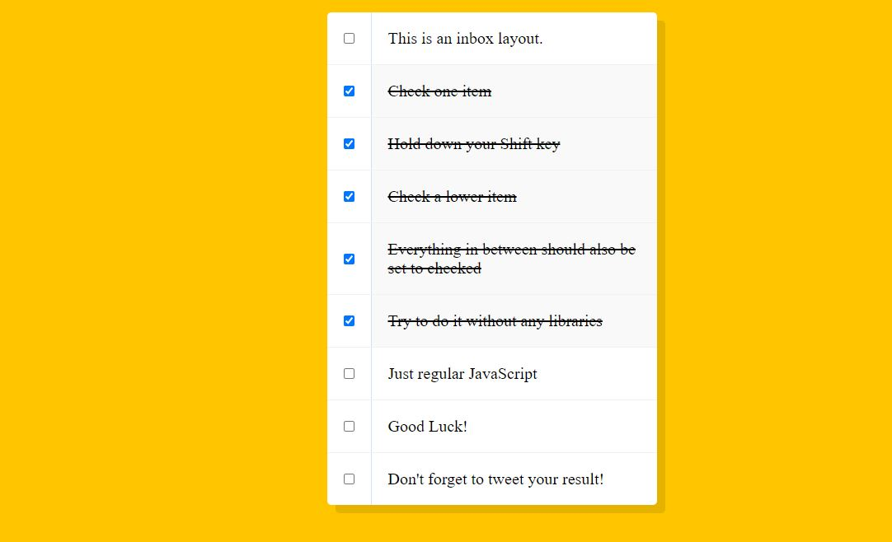

# JSCheckbox

This is from day 10 / 30 of Wes Bos' JavaScript30 course.  In this lesson we used JavaScript to enable the ability to mass check, checkboxes (like you would see in your email inbox) using the shift key.  This was a fun lesson and if you're interested you can find the video <a href src="https://www.youtube.com/watch?v=RIPYsKx1iiU&list=PLu8EoSxDXHP6CGK4YVJhL_VWetA865GOH&index=10">here.</a>

 

